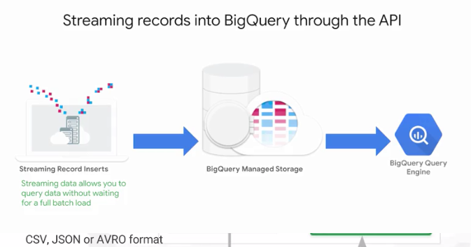

# BigQuery

BigQuery is a SQL engine and storage to go along with it.

)

### Pricing:
Start with a unit of work, AKA. Job or task:

- Running a query - charged by bytes processed
- Loading data into a table - free
- Extracting data to google cloud storage - free
- Copying existing tables (Prod -> Dev) - free
	
**Note:** storing data in BigQuery is a separate cost

#### Storage Costs:
- Based on amount of data in table (2c/GB/Month)
- Streaming data into big query is charged based on ingestion rate (5c/GB)
- Automatic discount for old data (after 90 days 1c/GB/month)
	
#### Processing Costs:
- On-demand or flat-rate plans
- On-demand is based on amount of data processed
- 1TB / month - free, then 5$ / TB
- Opt in to run high-compute queries

#### Free:
- Loading
- Exporting
- Queries on metadata
- Cached queries
- Queries with errors (syntax, not user)
	
#### Reserved Slots:
- Additional service that can be purchased
- Slots determine the amount of total query throughput
- Represents guaranteed resources, regardless of demand from other users
- Minimizes variability in query performance

##### Calculator: https://cloud.google.com/products/calculator/

##### Query validator: Validates query for syntax errors, and shows how much data will be processed
	
##### Query Quotas:
- Exist to protect infrastructure
- Can be changed based on teams if you have multiple teams using the platform
- Limits are as follows
    - 50 concurrent queries
    - Query timeout: 6 hours
    - 1,000 updates to a table per day
    - 1,000 tables referenced by a single query
    - Max result size: 128MB compressed
    
##### Loading and Exporting Data:

