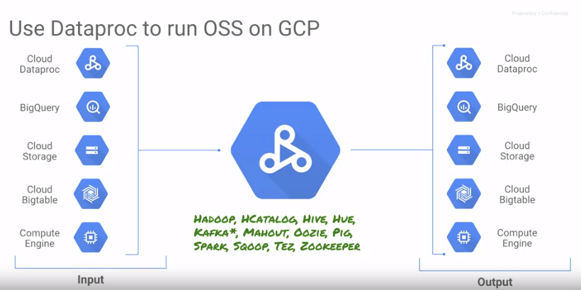

# Cloud DataProc (Compute Cluster)

Cloud-based implementation of Hadoop

##### Why run on cloud?
- Cheap storage at Petabyte scale
- No need to invest in and configure machines
- No need to tune environment to task at hand

#### Set-up

#####Creating a Dataproc cluster:
- Google cloud console
- CLI
	
#####Cluster configuration:
- **Name**: unique to your project (choose something you will remember)
- **Zone**: indicates where compute nodes will be located (choose same zone as where your data is stored)
- **Master Node: Cluster Mode:** 
    - Single node (all nodes on a single VM, for experimentation, cost control)
    - Standard (1 master node only)
    - High Availability (3 masters for long running jobs)
- Can set up firewall rules
- Can also install custom software on each of the dataproc master and workers
	
##### Custom Machine Types:
- Need to select the number of CPUs and amount of memory
	
##### Pre-emptible VMs:
- Enables reduced cost, under condition that it can be taken away with minimal warning
- Up to 80% cheaper, but not to be used for critical processing
- If node is removed, may lose process
- Keep at most a 50/50 ratio between dedicated and pre-emptible VMs
	
#####Running Jobs:
- Upload related files to bucket
- Open up fire-walls to port 9870 and 8088
- SSH into cluster to move files into HDFS and access software installed on the cluster such as Hive, Pig and PySpark
- Access the file system using port 9870
- Use port 8088 for the resource manager to check the status of jobs running
	
#####Input / Output:

#####Installing packages:
- Apache Bigtop is used for pre-installed software
    - A library of pre-built initialization scripts are hosted in this publicly available bucket: gs://dataproc-initialization-actions
    - See the GitHub repository at https://github.com/GoogleCloudPlatform/dataproc-initialization-actions
- Additional software can be added to master and worker nodes using installation scripts
    - When new instances join (additional workers), they will be installed automatically
- To install software on DataProc clusters:
    - Write an executable program (bash, python, etc)
    - Upload it to cloud storage
    - Specify cloud storage location in Dataproc creation command or web console

	
