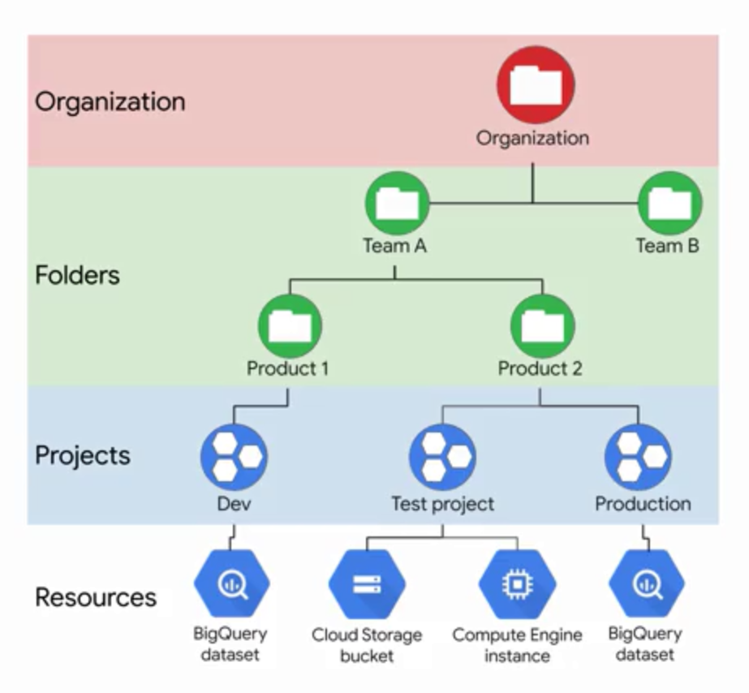

# Introduction to Google Cloud Platform

The cloud is a constantly changing environment and Google Cloud Platform is continually evolving and releasing new products and features. It's a good idea to bookmark the below links to stay ahead of updates:
- Google Cloud Platform blog: https://cloud.google.com/blog/products
- GCP big data product list: https://cloud.google.com/products/big-data/
- GCP customers and case studies: https://cloud.google.com/customers/#/

Need to practice SQL a bit more?
- BigQuery standard SQL guide: https://cloud.google.com/bigquery/docs/reference/standard-sql/
- Qwiklabs BigQuery quest for Data Analysts: https://www.qwiklabs.com/quests/55

Learn more about big data infrastructure:
- Compute Engine: https://cloud.google.com/compute/
- Storage: https://cloud.google.com/storage/
- Pricing: https://cloud.google.com/pricing/

Stay up to date with the latest resources on migrating your workloads to the cloud:
- Migrating Hadoop to Google Cloud Platform: https://cloud.google.com/solutions/migration/hadoop/hadoop-gcp-migration-overview
- Cloud SQL Documentation: https://cloud.google.com/sql/
    - Release blog: https://cloud.google.com/blog/products/databases/ 
- Cloud Dataproc Documentation: https://cloud.google.com/dataproc/
    - Release blog: https://cloud.google.com/blog/products/dataproc

## Google Cloud Platform Infrastructure
- Big Data and ML Products
- Compute
- Storage
- Networking
- Security

### Work Breakdown Structure

### Compute and storage are independent:
- Compute is done by VMs which you spin up and down
    - Once spun up, you install the software you need, and start computing
    - Results of computing can be stored in a storage bucket
- Storage is done by buckets, which always exist once you create and set permissions
	
### Multiple types of storage are available:
- For working projects:
    - Multi-Regional - optimized for geo redundancy and end-user latency
	- Regional - higher performance local access to computing
- For backups:
    - Nearline - for data accessed less than once a month
    - Coldline - for data accessed less than once a year

### Different storage services are available:
- Cloud bigtable
- Cloud storage
- Cloud SQL
- Cloud Spanner
- Cloud Datastore

### How to use storage:
- Can be done through UI or CLI
    - Create bucket
	- Set permissions
	- Populate files
	

### Different compute services are available:
- Compute Engine: Virtual machines used for computing tasks
- Google Kubernetes Engine: Clusters of machines running containers (code packaged with dependencies)
- App Engine: Platform as a service, a way to run code in the cloud without having to worry about infrastructure (serverless)
	- Used for web applications
	- Cloud functions: Functions as a service, executes code in response to events
	- Used for file transfers
		

	

	
	
	
	

	
	
	

